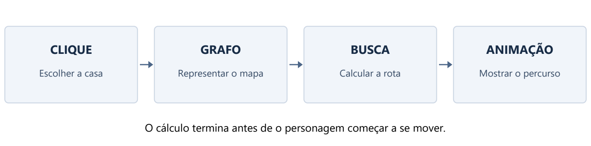

> Material das etapas iniciais. Para entender a interface atual, com 70 mapas, zoom e animação por tempo, consulte `Manual_atualizacao_mapas_zoom_animacao.md`. O PDF correspondente também descreve a interface anterior.

# Manual de implementação do tabuleiro de caminho mínimo

Aprenda a construir a aplicação em Python e a explicar suas decisões

Este manual ensina a implementar o tabuleiro que desenvolvemos: você clica em um destino, aperta Play e um personagem percorre uma rota mínima sem atravessar obstáculos. A explicação acompanha o código entregue e relaciona a interface ao problema de caminho mínimo em grafos.

Você começará por uma janela simples e acrescentará uma responsabilidade de cada vez. Depois, estudará os recursos da versão completa: animação suave, pausa, edição do mapa, teclado e ajuste ao tamanho da janela. Ao final, deverá conseguir explicar tanto o cálculo da rota quanto o funcionamento da interface.

O texto pressupõe que você reconheça variáveis, condições e laços em Python. As ideias de classe, evento, fila de prioridade e função de retorno são explicadas quando aparecem. Os exemplos são didáticos; o programa não usa mapas reais, localização por GPS ou serviços do Waze.

**Como estudar:** leia uma etapa, execute seu arquivo, faça a pequena alteração sugerida e confira o resultado. Os trechos do manual destacam partes do programa; não cole todos os blocos em sequência em um único arquivo. Cada arquivo de etapa já contém uma versão completa e executável daquele estágio.

O material acompanha quatro etapas, um módulo de algoritmos, um módulo de cenário e uma cópia da aplicação completa. A versão completa corresponde aos arquivos revisados em 21 de setembro de 2026. Os números de linha citados no apêndice valem para essa cópia e mudarão se você editar o programa.



## 1 Definir o problema antes de desenhar a interface

O personagem ocupa uma casa do tabuleiro. O usuário escolhe outra casa. O programa deve encontrar uma sequência de casas vizinhas livres que ligue as duas posições com o menor custo total.

Adotamos cinco regras: o tabuleiro é retangular; cada movimento vai para cima, baixo, esquerda ou direita; uma parede impede a passagem; cada movimento custa 1; e o mapa fica fixo durante cada cálculo de rota. Uma alteração posterior exige uma nova busca.

Essas regras são decisões de modelagem. Se permitíssemos diagonais, a quantidade de movimentos poderia diminuir. Se alguns terrenos fossem mais lentos, o custo deixaria de ser apenas a quantidade de passos. A resposta ótima depende das regras representadas no grafo.

Na versão completa, o tabuleiro tem 12 linhas e 18 colunas, totalizando 216 casas antes de descontar os obstáculos. O ponto azul é o personagem, o marcador amarelo indica o destino e a linha verde mostra o caminho calculado.

**Por que usar Dijkstra:** ele resolve caminhos mínimos com pesos não negativos e dá continuidade ao algoritmo estudado no trabalho. Para este tabuleiro, em que todos os pesos são 1, a busca em largura, ou BFS, também resolve o problema e tem um limite de tempo melhor. Dijkstra permite estudar a mesma estrutura de solução antes de uma possível extensão com custos diferentes.

**Relação com o livro:** no PDF da segunda edição de The Algorithm Design Manual, a seção 6.3, páginas 205 a 212, trata de caminhos mínimos. O exemplo The Pink Panther’s Passport to Peril aparece na seção 6.6, página 223. A ideia aplicada aqui é transformar posições válidas e movimentos permitidos em um grafo. A denominação “War Story 6.3” fornecida no enunciado não coincide com o título dessa seção na edição consultada.

**Confira seu entendimento:** uma rota com cinco movimentos custa quanto neste modelo? Custa 5. Essa equivalência só vale porque cada movimento custa exatamente 1.

## 2 Preparar os arquivos e o ambiente

O pacote de estudo está organizado assim:

```text
material_do_manual/
    etapa_01_janela.py
    etapa_02_tabuleiro.py
    etapa_03_busca.py
    etapa_04_animacao.py
    cenario.py
    roteamento.py
    versao_completa/
        tabuleiro.py
        roteamento.py
        Abrir tabuleiro.bat
        Como usar o tabuleiro.md
```

As quatro etapas usam uma janela simples, com casas de tamanho fixo. A pasta `versao_completa` contém a interface final, com painel lateral e recursos adicionais. A evolução entre essas duas versões será explicada na segunda metade do manual.

O arquivo `cenario.py` reúne as paredes do mapa. O `roteamento.py` da pasta de estudo contém apenas quatro funções usadas na construção: `validar`, `reconstruir`, `dijkstra_heap` e `grafo_da_grade`. Elas foram extraídas do módulo original sem mudar seus algoritmos. O módulo da versão completa mantém também BFS, Dijkstra simples, Floyd-Warshall e os exemplos de teste.

**Decisão de organização:** a interface e o cálculo ficam em arquivos separados. Assim, podemos verificar a busca sem abrir uma janela e mudar cores ou botões sem alterar o algoritmo. Uma função de caminho mínimo deve receber dados do grafo e devolver uma resposta; ela não precisa conhecer o mouse ou o Canvas.

Use Python 3.10 ou posterior com Tkinter disponível. Para verificar a instalação, abra um terminal na pasta de estudo e execute:

```text
python --version
python -m tkinter
```

O segundo comando deve abrir uma pequena janela de demonstração. Ele é recomendado na documentação oficial do Tkinter para verificar a instalação. Tkinter é a interface padrão do Python para Tcl/Tk, mas sua disponibilidade depende da instalação utilizada. Nesta máquina, a aplicação foi testada com Python 3.11. [Referência: documentação do Tkinter](https://docs.python.org/3/library/tkinter.html).

Para acompanhar o curso, execute uma etapa por vez:

```text
python etapa_01_janela.py
python etapa_02_tabuleiro.py
python etapa_03_busca.py
python etapa_04_animacao.py
```

Feche a janela de uma etapa antes de abrir a seguinte. Mantenha os módulos de apoio na mesma pasta. Evite chamar seus próprios arquivos de `tkinter.py`, `heapq.py` ou `math.py`, pois esses nomes podem esconder os módulos que o programa precisa importar.

## 3 Entender os objetos que aparecerão no código

Uma **função** agrupa instruções para realizar uma tarefa. `grafo_da_grade(grade)`, por exemplo, recebe uma grade e produz um grafo. Um **método** é uma função associada a uma classe. `self.draw_board()` desenha o tabuleiro do objeto atual.

A classe `RouteBoard`, na aplicação completa, reúne os dados e os comportamentos de uma instância do tabuleiro. `self` é a referência a essa instância. Atribuir `self.player = (2, 2)` guarda uma informação que outros métodos poderão consultar depois. Uma variável local como `r`, criada dentro de um método, serve apenas durante aquela chamada.

`__init__` prepara o objeto quando ele é criado. A chamada `RouteBoard(root)` cria o tabuleiro, guarda a janela recebida e monta a interface. Isso não inicia uma busca automaticamente: a busca será disparada pelo botão Play.

Uma posição é uma **tupla** `(linha, coluna)`. As tuplas são adequadas como chaves de dicionário e elementos de um conjunto porque, neste caso, contêm números imutáveis. A posição `(2, 2)` representa a terceira linha e a terceira coluna, pois os índices internos começam em zero.

Um **conjunto**, ou `set`, armazena as posições das paredes sem repetições. A pergunta `(r, c) in self.walls` verifica se determinada casa está bloqueada. Um **dicionário** associa uma chave a um valor; por exemplo, `distancia[(2, 2)] = 0` associa um custo a uma posição.

`None` indica ausência de valor: ainda não há destino ou não existe uma tarefa agendada. Uma lista vazia `[]` representa, por exemplo, ausência de caminho. `inf`, importado de `math`, representa infinito e permite registrar que ainda não conhecemos uma distância finita.

## 4 Etapa um criar a janela

Abra `etapa_01_janela.py`. Seu núcleo é:

```python
import tkinter as tk

def main():
    root = tk.Tk()
    root.title("Etapa 1 - Janela")
    canvas = tk.Canvas(
        root, width=612, height=408, bg="#15243a"
    )
    canvas.pack(padx=16, pady=16)
    root.mainloop()

if __name__ == "__main__":
    main()
```

`import tkinter as tk` dá ao módulo um nome curto. `tk.Tk()` cria a janela principal, guardada em `root`. O título aparece na barra da janela. `tk.Canvas` cria a área em que desenharemos as casas e os pontos.

O primeiro argumento de `Canvas` é seu componente pai, `root`. `width` e `height` definem o tamanho solicitado. `bg` define a cor de fundo em notação hexadecimal. As cores ajudam a distinguir o espaço livre das paredes e dos marcadores; elas não afetam as decisões de caminho mínimo.

`pack` posiciona o Canvas. `padx` e `pady` acrescentam espaço nas direções horizontal e vertical. Criar um componente e posicioná-lo são operações diferentes.

`mainloop()` mantém a aplicação processando eventos. Um evento pode ser um clique, uma tecla, um pedido de redesenho ou a execução de uma função agendada. Essa organização permite que a janela responda ao usuário enquanto permanece aberta.

A condição `if __name__ == "__main__"` chama `main()` quando o arquivo é executado diretamente. Ao importar esse arquivo em um teste, a janela não abre automaticamente. Isso torna o código mais fácil de verificar e reutilizar.

**Faça agora:** mude o título e a cor de fundo, execute novamente e confirme a alteração. **Resultado esperado:** apenas uma janela com a área de desenho; ainda não há grade, obstáculos ou busca.

## 5 Etapa dois representar o tabuleiro e as paredes

Abra `etapa_02_tabuleiro.py`. Começamos com três constantes:

```python
ROWS, COLS, CELL = 12, 18, 34
```

`ROWS` é o número de linhas, `COLS` é o número de colunas e `CELL` é o lado de uma casa em pixels. A área da grade mede `18 * 34 = 612` pixels por `12 * 34 = 408` pixels. Nesta etapa, o tamanho fixo simplifica a relação entre posição lógica e desenho.

O cenário vem de `default_walls()`. Veja a primeira parede:

```python
walls = {(r, 5) for r in range(1, 10) if r != 7}
```

Esse código cria casas bloqueadas na coluna de índice 5, da linha de índice 1 até a de índice 9. `range(1, 10)` não inclui 10. A condição `r != 7` deixa uma passagem na linha de índice 7. Na tela, isso corresponde à coluna 6 e à linha 8.

Essa forma curta chama-se compreensão de conjunto. Você pode reescrevê-la assim para estudar:

```python
walls = set()
for r in range(1, 10):
    if r != 7:
        walls.add((r, 5))
```

As demais construções do cenário seguem a mesma ideia. Dois laços de compreensão criam um bloco retangular; uma condição deixa uma abertura; `walls |= outro_conjunto` faz a união das paredes já existentes com novas posições. A união mantém apenas uma cópia de cada posição.

O mapa tem uma parede vertical com passagem, um bloco central, uma parede horizontal com abertura, um bloco no alto à direita e um pequeno recinto fechado. O interior desse recinto, `(9, 2)`, está livre, mas é inacessível. Ele serve para testar o caso “Sem rota”.

**Por que um mapa fixo:** ele permite repetir a mesma demonstração e comparar resultados. Um mapa aleatório pode ser interessante depois, mas dificulta a verificação inicial se cada execução produzir uma entrada diferente.

No desenho, percorremos todas as posições:

```python
for r in range(ROWS):
    for c in range(COLS):
        x, y = c * CELL, r * CELL
        color = "#43566e" if (r, c) in self.walls else "#15243a"
        self.canvas.create_rectangle(
            x, y, x + CELL, y + CELL,
            fill=color, outline="#23344c"
        )
```

O Canvas usa coordenadas `(x, y)` em pixels. A coordenada `x` cresce para a direita e `y` cresce para baixo. A coluna determina `x`; a linha determina `y`. Inverter essa relação faz o desenho aparecer transposto.

O retângulo recebe dois cantos: superior esquerdo e inferior direito. `fill` colore o interior e `outline` desenha a borda. A decisão “parede ou casa livre” vem de `self.walls`, e não da cor que foi pintada.

**Confira:** uma casa escura desenhada como parede, mas ausente de `self.walls`, não bloquearia o algoritmo. Os dados do cenário precisam ser a fonte da verdade.

## 6 Desenhar os pontos e interpretar o clique

O centro de uma casa é usado para posicionar personagem e destino:

```python
def center(self, cell):
    r, c = cell
    return (c + 0.5) * CELL, (r + 0.5) * CELL
```

Multiplicar por `CELL` leva ao início da casa. Somar meia casa leva ao centro. `create_oval(x - raio, y - raio, x + raio, y + raio)` desenha um círculo dentro desse quadrado. O personagem usa um círculo preenchido; o destino usa um contorno para continuar reconhecível quando o personagem chegar.

Para receber cliques, registramos:

```python
self.canvas.bind("<Button-1>", self.on_click)
```

`bind` liga um evento a um método. `self.on_click` é passado sem parênteses: estamos entregando o método para ser chamado depois. Se escrevêssemos `self.on_click()`, tentaríamos executá-lo durante a construção da interface.

Quando ocorre o clique, Tkinter entrega um objeto `event`. Seus atributos `x` e `y` indicam a posição relativa ao Canvas:

```python
def on_click(self, event):
    r, c = event.y // CELL, event.x // CELL
    self.select_cell((r, c))
```

`//` é divisão inteira com arredondamento para baixo. Para casas de 34 pixels, um clique em `x = 85` pertence à coluna `85 // 34 = 2`. Um clique em `y = 119` pertence à linha `119 // 34 = 3`. A casa interna é `(3, 2)`, exibida ao usuário como linha 4, coluna 3.

`select_cell` primeiro confere os limites, depois rejeita obstáculos e finalmente guarda o destino. A tela é redesenhada para mostrar a seleção. Na etapa 2, isso ainda não calcula nenhuma rota.

**Por que separar os dois métodos:** `on_click` traduz um evento do mouse. `select_cell` recebe uma posição lógica. O teclado e os testes podem chamar `select_cell` sem inventar um clique de mouse.

**Faça agora:** clique numa casa livre, numa parede e perto da borda. **Resultado esperado:** apenas uma casa livre dentro dos limites pode virar destino.

## 7 Transformar casas livres em um grafo

Abra `roteamento.py` e localize `grafo_da_grade`. A função recebe uma lista de strings: `#` indica parede e qualquer outro caractere indica espaço livre. Uma entrada pequena seria:

```python
grade = ["..#", "..."]
```

Ela tem cinco casas livres. Cada uma se torna uma chave do dicionário do grafo:

```python
grafo = {
    (i, j): []
    for i in range(linhas)
    for j in range(colunas)
    if grade[i][j] != "#"
}
```

A lista associada a cada posição armazenará seus vizinhos. Em seguida, tentamos quatro deslocamentos:

```python
for i, j in grafo:
    for di, dj in [(-1, 0), (0, 1), (1, 0), (0, -1)]:
        vizinho = (i + di, j + dj)
        if vizinho in grafo:
            grafo[(i, j)].append((vizinho, 1))
```

Os pares representam cima, direita, baixo e esquerda. A expressão `vizinho in grafo` exige que o destino exista e seja livre. Assim, uma posição fora do tabuleiro ou dentro de uma parede não ganha uma aresta.

O par `((0, 1), 1)` significa “é possível ir para `(0, 1)` pagando custo 1”. A lista de vizinhos de `(0, 0)` no pequeno exemplo contém `((0, 1), 1)` e `((1, 0), 1)`.

Cada ligação aparece nas duas direções porque ambos os vértices testam seus vizinhos. Ao contar `m`, o número de arestas do dicionário, contamos cada direção separadamente. O pequeno exemplo tem cinco vértices e dez arestas dirigidas.

A função também rejeita grades vazias e linhas com comprimentos diferentes. Essa validação impede que um erro de formato apareça depois como um problema de busca.

Na interface completa, `make_graph()` monta as strings a partir de `self.walls` e chama `grafo_da_grade`. Os objetos desenhados no Canvas não são consultados para criar o grafo.

**Decisão sobre obstáculos:** não criamos uma aresta para atravessar uma parede. Usar um custo alto no lugar disso poderia permitir a travessia se todas as alternativas fossem ainda mais caras.

## 8 Implementar Dijkstra e recuperar o caminho

As funções do motor têm contratos diferentes: `validar` confere a entrada; `dijkstra_heap` encontra o custo; `reconstruir` transforma predecessores em uma sequência de posições. Dijkstra devolve `(custo, caminho)`. Se o destino for inalcançável, devolve `(inf, [])`.

`validar` exige que todo vizinho também exista como chave, que os pesos sejam finitos e não negativos e que origem e destino informados pertençam ao grafo. `None` é reservado para ausência de predecessor e não pode ser usado como vértice. Na interface, origem e destino são sempre tuplas válidas.

Começamos com estas estruturas:

```python
distancia = {v: inf for v in grafo}
anterior = {v: None for v in grafo}
distancia[origem] = 0
ordem = count()
fila = [(0, next(ordem), origem)]
```

`distancia[v]` guarda a melhor distância conhecida até `v`. `anterior[v]` guarda quem vem antes de `v` nessa rota. O custo da origem é zero porque nenhum movimento foi feito. Os outros valores começam em infinito porque ainda não encontramos rotas para eles.

A fila é um heap mínimo. Cada entrada contém `(custo, desempate, vertice)`. `heappop` retira a entrada com menor prioridade; `heappush` insere uma entrada preservando a estrutura. Essas operações não ordenam a lista inteira a cada chamada. [Referência: documentação de heapq](https://docs.python.org/3/library/heapq.html).

`count()` fornece 0, 1, 2 e assim por diante. O segundo campo desempata entradas com o mesmo custo. Isso evita depender da comparação entre os nomes dos vértices e torna o desempate previsível conforme a ordem de inserção. O campo não faz parte do custo da rota.

O laço principal é:

```python
while fila:
    custo, _, u = heappop(fila)

    if custo != distancia[u]:
        continue
    if u == destino:
        break

    for v, peso in grafo[u]:
        novo_custo = custo + peso
        if novo_custo < distancia[v]:
            distancia[v] = novo_custo
            anterior[v] = u
            heappush(fila, (novo_custo, next(ordem), v))
```

O nome `_` recebe o desempate porque não precisamos usá-lo depois da retirada. A comparação `custo != distancia[u]` descarta uma entrada antiga, inserida antes de encontrarmos um caminho melhor para o mesmo vértice. Essa técnica evita implementar uma operação de atualização interna de prioridades.

Verificamos o destino somente depois de descartar entradas antigas. Encontrar o destino entre os vizinhos não basta para encerrar: uma rota melhor ainda pode estar pendente. A retirada válida da menor prioridade é o momento seguro para finalizar sua distância.

Para cada vizinho, somamos o custo acumulado ao peso da próxima aresta. Quando a soma melhora a estimativa, atualizamos distância e predecessor e inserimos uma nova entrada. Essa operação é o **relaxamento**. Usamos `<`, não `<=`, porque uma rota de custo igual não melhora a resposta e não precisa gerar novas entradas.

No pequeno grafo da seção anterior, de `(0, 0)` até `(1, 2)`, uma resposta é:

```text
(0, 0) -> (0, 1) -> (1, 1) -> (1, 2)
Custo = 3
```

Outra rota pode ter o mesmo custo. O programa devolve uma das rotas mínimas, sem prometer uma preferência visual por cima ou por baixo.

**Por que a escolha funciona:** ao retirar o menor custo pendente, nenhuma rota que ainda precise passar por um vértice mais distante poderá barateá-lo usando apenas pesos não negativos. Se houvesse uma rota melhor, o primeiro vértice ainda pendente dessa rota já teria recebido uma estimativa capaz de disputar uma prioridade menor. Essa propriedade sustenta a correção de Dijkstra.

Para recuperar o caminho, seguimos os predecessores a partir do destino:

```python
caminho = []
atual = destino
while atual is not None:
    caminho.append(atual)
    atual = anterior[atual]
caminho.reverse()
```

O percurso obtido primeiro está de trás para frente. `reverse()` inverte essa lista. A origem encerra a cadeia porque seu predecessor é `None`. Antes desse laço, a função verifica se o custo do destino é infinito; nesse caso, retorna uma lista vazia.

**Teste seu entendimento:** por que não escolher apenas a aresta mais barata do vértice atual? Porque o que precisa ser mínimo é o custo completo desde a origem. Dijkstra ordena candidatos por esse custo acumulado.

## 9 Etapa três ligar o botão Play ao algoritmo

Abra `etapa_03_busca.py`. O novo botão recebe uma função a executar:

```python
tk.Button(root, text="Play", command=self.play).pack(pady=8)
```

`command` é a ação do botão. Novamente, `self.play` é passado sem parênteses. Diferentemente do método associado a `bind`, esse método não recebe automaticamente um objeto de evento.

O método `play` verifica se existe destino, cria a grade, converte-a em grafo e chama a busca:

```python
grade = [
    "".join("#" if (r, c) in self.walls else "."
            for c in range(COLS))
    for r in range(ROWS)
]
grafo = grafo_da_grade(grade)
cost, self.path = dijkstra_heap(grafo, self.player, self.target)
```

`join` junta os caracteres de uma linha. A compreensão externa produz todas as linhas. A atribuição com dois nomes separa os dois valores devolvidos pelo algoritmo: o número vai para `cost`, e a sequência de casas vai para `self.path`.

Nesta etapa, o personagem permanece no lugar. Desenhamos somente a linha do caminho. Para isso, transformamos cada casa em seu centro e achatamos os pares de coordenadas:

```python
points = [xy for cell in self.path for xy in self.center(cell)]
self.canvas.create_line(*points, fill="#4fe2af", width=3)
```

Uma sequência como `[(17, 17), (51, 17)]` vira `[17, 17, 51, 17]`. O asterisco em `*points` distribui os valores como argumentos do método. A linha só é criada se houver ao menos duas posições.

**Faça agora:** marque a linha 12, coluna 18, partindo da origem inicial. O custo esperado é 24 movimentos. Depois marque a linha 10, coluna 3, dentro do recinto fechado: o resultado deve ser “Sem rota”. Selecione a própria origem para obter custo zero.

**Ponto de verificação:** acertar os três casos antes de animar separa erros do algoritmo de erros da apresentação.

## 10 Etapa quatro movimentar o personagem sem bloquear a janela

Abra `etapa_04_animacao.py`. A busca ainda calcula a rota inteira antes da animação. Acrescentamos `self.path_index`, que indica a posição atual na lista, e `self.job`, que guarda o identificador de uma chamada agendada.

O início da animação usa:

```python
self.job = self.root.after(160, self.tick)
```

Essa instrução agenda `tick` para uma execução futura, após pelo menos aproximadamente 160 milissegundos, conforme a disponibilidade do laço de eventos. Ela não garante uma temporização exata. O programa retorna ao processamento normal da interface enquanto espera.

Na versão didática, cada chamada avança uma casa:

```python
def tick(self):
    self.job = None
    self.path_index += 1
    self.player = self.path[self.path_index]
    self.draw_board()
    if self.path_index < len(self.path) - 1:
        self.job = self.root.after(160, self.tick)
    else:
        self.status.set(f"Chegou em {self.path_index} movimentos.")
```

O índice começa em zero, que representa a posição inicial. Um caminho com 25 posições exige 24 movimentos. Por isso comparamos o índice com `len(self.path) - 1`.

`self.job = None` informa que a chamada agendada atual já começou e deixou de estar pendente. Se ainda houver caminho, guardamos o identificador da próxima chamada. Ao terminar, não agendamos outra.

**Por que não usar um laço com `sleep`:** esse laço ocuparia a mesma execução que precisa processar os eventos da janela. O resultado seria uma interface que não responde adequadamente enquanto o personagem se move. Agendar pequenos passos preserva oportunidades de atender cliques e redesenhos.

Se o usuário escolher outro destino, cancelamos a chamada pendente antes de substituir a rota. Ao fechar a janela, também cancelamos o agendamento. Isso impede que uma animação antiga tente continuar com dados novos ou numa janela já destruída.

Os casos de custo zero e destino inalcançável são tratados antes do primeiro agendamento. Assim, `tick` só é iniciado quando existe uma posição seguinte válida.

**Faça agora:** inicie uma rota e escolha outro destino antes da chegada. A etapa didática interrompe o percurso anterior; um novo Play calcula a rota a partir da posição atual. A pausa com retomada e os movimentos suaves serão estudados a seguir.

## 11 Conhecer o estado da aplicação completa

Agora abra `versao_completa/tabuleiro.py`. A classe passa a se chamar `RouteBoard`. Ela reúne a mesma ideia construída nas etapas e acrescenta recursos de interação e apresentação.

O **estado** é o conjunto de informações que descreve o tabuleiro em determinado momento. Guardamos os dados no objeto para que um clique, um botão e um quadro de animação possam trabalhar com as mesmas informações.

| Atributo | O que representa | Exemplo ou regra |
| --- | --- | --- |
| `walls` | Casas bloqueadas | Conjunto de tuplas |
| `start` | Origem escolhida para reiniciar | Inicialmente `(2, 2)` |
| `player` | Última casa efetivamente alcançada | Sempre uma casa livre |
| `visual_player` | Posição usada no desenho | Pode ter coordenadas fracionárias |
| `target` | Destino selecionado | Tupla ou `None` |
| `path` | Rota da consulta atual | Lista de posições |
| `path_index` | Índice da última casa alcançada na rota | Começa em zero |
| `frame` | Progresso dentro do movimento atual | De zero até oito durante a atualização |
| `running` | Animação em execução | Booleano |
| `paused` | Existe animação suspensa para continuar | Booleano |
| `job` | Próxima chamada de animação agendada | Identificador ou `None` |

**Por que separar `start` e `player`:** a origem de referência serve ao botão Reiniciar. O personagem muda de posição durante o movimento. Quando uma nova consulta começa, `play` usa `player`, ou seja, sua posição atual. Manter apenas a origem inicial faria todas as consultas partirem sempre do mesmo lugar.

**Por que separar `player` e `visual_player`:** a busca opera em casas discretas, mas o desenho precisa se mover suavemente entre elas. Durante a travessia de `(2, 2)` para `(2, 3)`, a posição visual pode ser `(2.0, 2.5)`. Essa posição fracionária não é um vértice do grafo.

Há também informações de apresentação:

| Atributo | Responsabilidade |
| --- | --- |
| `root` e `canvas` | Janela e área de desenho |
| `cell_size` e `offset` | Tamanho das casas e deslocamento da grade |
| `cursor` | Casa escolhida pelo teclado |
| `compact` | Indica se o painel usa espaçamento reduzido |
| `mode` | Ação do clique: destino, origem ou obstáculo |
| `status` | Mensagem de andamento ou orientação |
| `distance` | Texto do custo mínimo mostrado no painel |
| `progress` | Texto com movimentos concluídos |
| `destination` e `hint` | Rótulo do destino e instrução de uso |

`mode`, `status`, `distance`, `progress`, `destination` e `hint` são objetos `StringVar`. Um rótulo criado com `textvariable=self.status` acompanha o valor dessa variável. `self.status.set("Destino alcançado!")` muda a informação exibida sem recriar o rótulo.

Não confunda `self.distance`, que é texto para a interface, com o dicionário `distancia` dentro de Dijkstra. O dicionário participa do cálculo; o texto apresenta o resultado.

`__init__` inicializa todos esses atributos antes de montar a interface. Isso evita que um evento consulte um atributo ainda inexistente. Por último, `root.protocol("WM_DELETE_WINDOW", self.close)` associa o fechamento da janela à limpeza dos agendamentos.

## 12 Adaptar a grade ao tamanho da janela

As etapas didáticas usam casas de 34 pixels. A aplicação completa calcula o tamanho disponível para que o tabuleiro inteiro caiba no Canvas:

```python
self.cell_size = min(
    (width - 42) / COLS,
    (height - 42) / ROWS
)
s = self.cell_size
self.offset = (
    (width - s * COLS) / 2,
    (height - s * ROWS) / 2
)
```

Uma restrição vem da largura; outra, da altura. Escolher o menor limite preserva casas quadradas e evita que a grade ultrapasse uma das dimensões. Os 42 pixels reservam margem para os números das linhas e colunas. Essa margem é uma escolha de apresentação.

`offset` guarda o espaço antes da grade. A diferença entre a largura disponível e a largura ocupada é dividida por dois para centralizar o desenho. A mesma operação vale para a altura.

O centro de uma posição passa a considerar esse deslocamento:

```python
return x + (c + .5) * s, y + (r + .5) * s
```

Aqui, `x` e `y` são os deslocamentos, e `s` é o tamanho da casa. O clique precisa aplicar a transformação inversa:

```python
ox, oy = self.offset
r = int((y - oy) // self.cell_size)
c = int((x - ox) // self.cell_size)
```

Primeiro retiramos a margem; depois descobrimos a casa. Se `ox = 20`, `oy = 30` e `s = 40`, um clique em `(115, 125)` produz a posição `(2, 2)`. O centro dessa casa está em `(120, 130)`.

O método `cell_at` retorna `None` quando o resultado fica fora dos limites. Assim, clicar na margem não seleciona a primeira ou a última casa por engano. O código não usa arredondamento para o inteiro mais próximo, pois isso escolheria outra casa perto de algumas bordas.

O evento `<Configure>` do Canvas chama `draw_board` quando seu tamanho muda. A verificação `width < 20 or height < 20` evita desenhar durante estados iniciais em que o componente ainda não recebeu uma área útil.

**Faça agora:** redimensione a janela, clique perto dos quatro cantos da grade e confirme que o marcador acompanha a casa apontada. Um desenho correto com seleção deslocada indica que a transformação do clique não corresponde à transformação do desenho.

## 13 Separar o desenho fixo do desenho que muda

`draw_board` reconstrói a grade, as paredes e os números. Ele usa dois laços para as casas, verifica quais estão bloqueadas e acrescenta a pequena linha clara no alto de cada parede. Esse detalhe dá contraste ao obstáculo sem participar do cálculo.

`draw_overlay` desenha a rota, a origem, o destino e o personagem. Todos esses objetos recebem a etiqueta `dynamic`:

```python
self.canvas.delete("dynamic")
```

Ao apagar essa etiqueta, removemos apenas os objetos que serão atualizados. A grade e as paredes permanecem no Canvas. No redesenho completo, `delete("all")` remove também a parte fixa, que é reconstruída a seguir.

A ordem de desenho determina a sobreposição. Primeiro vêm as casas destacadas da rota, depois a linha verde, os pontos intermediários, a origem, o destino e, por fim, o personagem. Assim, o caminho não encobre o personagem. A origem fica marcada por um círculo tracejado mesmo depois da partida.

`points` contém os centros das casas da rota. `create_line` conecta esses centros. Como as casas consecutivas são vizinhas ortogonais e livres, a linha acompanha movimentos válidos do modelo.

O cursor de seleção recebe outra etiqueta, `hover`. `tag_raise("hover")` o coloca acima dos elementos dinâmicos. `on_hover` apaga o contorno anterior e desenha um novo na casa sob o mouse. Ao sair do Canvas, o evento `<Leave>` remove esse contorno.

**Decisão de custo:** preservamos a grade durante a animação, mas redesenhamos a rota inteira em cada quadro. Isso mantém a implementação compreensível para o tamanho escolhido. A análise da seção 19 contabiliza esse trabalho e explica como reduzi-lo numa versão maior.

## 14 Entender todas as ações do clique

Na versão completa, o usuário escolhe entre três modos. `mode_changed` muda apenas a instrução de uso; alterar o modo não modifica o mapa nem inicia uma busca.

`on_click` dá foco ao Canvas, converte pixels em uma posição e chama `select_cell`. Dar foco permite que as setas e a tecla Enter funcionem no tabuleiro depois do clique.

`select_cell` começa verificando os limites e atualizando o cursor. Em seguida, trata o modo selecionado.

**No modo obstáculo**, a posição pode ganhar ou perder uma parede. Antes da alteração, o código protege a casa atual do personagem, a origem de referência e o destino. Isso impede que um ponto importante seja transformado em parede sem ser reposicionado.

Se a alteração for permitida, `clear_route` interrompe qualquer animação, descarta o caminho antigo e limpa os indicadores. Depois, `walls.remove(cell)` abre uma passagem ou `walls.add(cell)` fecha uma casa. O redesenho completo reflete o novo cenário. Será necessário apertar Play para calcular a rota nesse cenário.

**No modo origem**, rejeitamos uma parede e depois atribuímos a mesma posição a `start` e `player`. A posição visual é sincronizada com essa casa. O destino anterior é preservado, permitindo repetir uma consulta com outra origem.

**No modo destino**, rejeitamos uma parede e guardamos a nova posição em `target`. O painel mostra `r + 1` e `c + 1`, para que a numeração visível comece em 1. O personagem permanece na casa atual até o usuário apertar Play.

Um clique inválido numa parede exibe uma orientação e preserva a seleção anterior. Se uma animação estava em andamento, esse clique inválido não a cancela. Já uma mudança válida de destino, origem ou obstáculo limpa a rota anterior.

Quando uma alteração acontece no meio de um movimento suave, o personagem visual retorna à última casa efetivamente alcançada, armazenada em `player`. Isso evita iniciar a próxima busca em coordenadas fracionárias, que não existem no grafo.

**Invariante importante:** depois de cada ação válida, personagem e destino selecionado continuam em casas livres. Uma invariante é uma propriedade que o programa precisa preservar ao longo das operações.

## 15 Ler o método Play como uma sequência de decisões

O mesmo botão inicia, pausa ou continua uma animação. Por isso, o método `play` verifica os estados numa ordem específica:

| Condição encontrada | Ação tomada |
| --- | --- |
| `running` é verdadeiro | Cancela o próximo quadro e marca a animação como pausada |
| `paused` é verdadeiro | Retoma o caminho e o quadro preservados |
| `target is None` | Pede a seleção de um destino |
| Nenhuma condição anterior | Limpa a consulta antiga e calcula uma nova rota |
| Resultado com custo infinito | Mostra “Sem rota” e mantém o personagem parado |
| Resultado com custo zero | Informa que o personagem já está no destino |
| Resultado finito positivo | Mostra o custo e agenda a animação |

As primeiras verificações retornam imediatamente depois de tratar o caso. Isso impede, por exemplo, que clicar para pausar também execute o trecho que calcula uma nova rota.

A consulta usa:

```python
cost, self.path = dijkstra_heap(
    self.make_graph(), self.player, self.target
)
```

`make_graph` cria um retrato do mapa atual. `player` é a origem da consulta, e `target` é o destino. O valor de `start` não aparece nessa chamada porque ele serve à ação de reiniciar.

O mapa é pequeno e a busca é síncrona: ela acontece na própria chamada do botão. A animação, por sua vez, é agendada em pequenos quadros. Em mapas muito maiores, uma busca longa poderia atrasar a resposta da janela; seria necessário planejar uma execução incremental ou em outra linha de execução com atualização segura da interface. Esse recurso não está implementado nesta versão.

O texto “menor caminho” apresenta a quantidade de movimentos da rota calculada no início da consulta. Ele não é uma estimativa que vai sendo recalculada durante a animação. O texto de progresso informa quantos movimentos dessa rota foram concluídos.

## 16 Fazer a animação suave quadro a quadro

A etapa 4 salta entre casas. A versão completa divide cada movimento em oito quadros. O trecho principal de `tick` é:

```python
self.frame += 1
a, b = self.path[self.path_index:self.path_index + 2]
fraction = self.frame / 8
self.visual_player = (
    a[0] + (b[0] - a[0]) * fraction,
    a[1] + (b[1] - a[1]) * fraction
)
```

O recorte da lista seleciona a casa atual `a` e a seguinte `b`. A expressão `a + (b - a) * fraction` é uma interpolação linear: sai de `a` e avança uma fração da distância até `b`.

Considere a travessia de `(2, 2)` para `(2, 3)`:

| Quadro | Fração | Posição visual |
| --- | --- | --- |
| 1 | 1/8 | `(2.0, 2.125)` |
| 4 | 4/8 | `(2.0, 2.5)` |
| 8 | 8/8 | `(2.0, 3.0)` |

Nos sete primeiros quadros, `player` ainda guarda `(2, 2)`. Quando `frame == 8`, o movimento termina: `player` recebe `b`, `path_index` aumenta em 1 e `frame` volta a zero. O indicador de progresso também é atualizado nesse momento.

Se `path_index == len(path) - 1`, o personagem chegou. O código marca `running = False`, muda a mensagem e deixa de agendar novos quadros. Isso também protege o próximo acesso a duas posições consecutivas: nunca iniciamos outro movimento depois da última casa.

Cada próximo quadro usa `after(20, self.tick)`. O intervalo nominal por movimento é `8 * 20 = 160` milissegundos, além do trabalho de desenho e de eventuais atrasos do laço de eventos. A duração visual não mede a velocidade de Dijkstra, que já terminou antes do primeiro quadro.

**Faça agora:** acompanhe uma pausa no meio de um trecho. Na retomada, `frame`, `path_index` e `visual_player` continuam de onde estavam. Isso é diferente de interromper a rota para escolher um novo destino.

## 17 Cancelar pausar reiniciar e restaurar corretamente

Essas ações parecem parecidas na tela, mas precisam preservar informações diferentes.

`cancel_animation` cancela `job`, se existir, define `job = None` e marca `running = False`. Ele preserva o caminho, o índice, o quadro e a posição visual. Por isso pode ser usado para pausar sem perder o ponto exato da animação.

`clear_route` chama esse cancelamento e depois descarta os dados da consulta: `paused = False`, `path = []`, índices zerados e indicadores limpos. Também sincroniza a posição visual com a posição lógica. Ele não apaga as paredes, a origem ou o destino.

| Ação | Personagem | Destino e paredes | Caminho atual |
| --- | --- | --- | --- |
| Pausar | Fica no ponto visual atual | Preservados | Preservado para continuar |
| Reiniciar percurso | Volta a `start` | Preservados | Descartado |
| Restaurar tabuleiro | Volta à origem padrão | Destino apagado e paredes padrão | Descartado |
| Escolher novo destino | Fica na última casa alcançada | Novo destino e mesmas paredes | Descartado |
| Fechar | Janela encerrada | Nenhum salvamento em arquivo | Agendamento cancelado |

`restart` é adequado para repetir a mesma experiência: mantém cenário e destino, mas devolve o personagem à origem de referência. `restore` é adequado para recuperar o cenário inicial depois de várias edições.

`close` cancela a animação antes de `root.destroy()`. Manter um identificador para o próximo quadro torna possível fazer esse cancelamento sem procurar ou interromper eventos que não pertencem ao tabuleiro.

**Erro que essa organização evita:** apertar Play repetidas vezes e acumular várias cadeias de chamadas, fazendo o personagem avançar em velocidade inesperada. Uma consulta ativa controla seu próprio agendamento.

## 18 Montar o painel e oferecer outras formas de interação

O método `_build_ui` cuida da construção dos componentes. O sublinhado inicial indica que ele é um método de apoio interno por convenção; Python não impede sua chamada por outros códigos.

A janela contém um cabeçalho, uma área central e uma instrução de teclado no rodapé. A área central contém o tabuleiro à esquerda e o painel à direita. Cada `Frame` organiza seus próprios filhos. Isso permite que regiões tenham regras de tamanho diferentes.

**Escolha de posicionamento:** usamos `pack` para empilhar grandes regiões e `grid` para organizar as duas colunas e as linhas do painel. Eles são usados em pais diferentes. Misturar filhos gerenciados por `pack` e `grid` dentro do mesmo componente pai deve ser evitado.

`fill="both"` e `expand=True` permitem que o Canvas cresça. `columnconfigure(..., weight=1)` e `rowconfigure(..., weight=1)` indicam quais linhas e colunas recebem espaço adicional. `sticky="nsew"` faz o componente ocupar a área nos quatro sentidos. As letras representam norte, sul, leste e oeste.

O painel tem largura solicitada de 260 pixels. `grid_propagate(False)` evita que o tamanho solicitado por seus filhos altere livremente essa dimensão. Por isso também precisamos planejar a quebra do texto e verificar se todos os controles cabem. `wraplength=215` limita a largura dos textos; a mensagem de estado reserva quatro linhas para reduzir deslocamentos do painel quando muda.

Os botões e seletores usam `ttk`. `Style.configure` define propriedades comuns e `Style.map` define a aparência em estados como ativo ou desabilitado. O tema `clam` foi usado para permitir uma aparência consistente dos controles. Essa configuração se apoia no sistema de estilos do ttk. [Referência: documentação de tkinter.ttk](https://docs.python.org/3/library/tkinter.ttk.html).

O botão Play começa desabilitado porque ainda não existe destino. Depois da seleção, o programa o habilita. Mesmo assim, `play` verifica `target is None`: uma função não deve depender exclusivamente do estado visual de um botão para manter suas pré-condições.

`fit_sidebar` observa o tamanho do painel. Abaixo de 590 pixels, reduz espaçamentos e algumas fontes. A comparação com `self.compact` evita reaplicar as mesmas configurações em toda notificação de tamanho. `update_distance_font` usa fonte 23 para “Sem rota”, 26 para números no modo compacto e 40 no modo normal. Os valores são ajustes de legibilidade, não parâmetros do algoritmo.

**Teclado:** `takefocus=True` permite focar o Canvas. As setas mudam `cursor`, Enter seleciona a casa e Espaço aciona Play. `move_cursor` usa `min` e `max` para manter o cursor nos limites e retorna `"break"` para interromper o processamento adicional daquele evento.

O vínculo das setas usa um detalhe importante:

```python
for key, delta in [("Up", (-1, 0)), ("Down", (1, 0)),
                   ("Left", (0, -1)), ("Right", (0, 1))]:
    self.canvas.bind(
        f"<{key}>", lambda e, d=delta: self.move_cursor(d)
    )
```

`lambda` cria uma pequena função. O argumento padrão `d=delta` guarda o deslocamento daquela iteração. Sem essa captura, as funções poderiam consultar o mesmo valor final de `delta`, fazendo teclas diferentes moverem o cursor na mesma direção.

As cores do dicionário `COLORS` distinguem fundo, parede, personagem, destino e rota. Há também letras e formatos diferentes, para que a identificação não dependa só da cor. Tamanhos de círculo proporcionais a `cell_size` mantêm os marcadores dentro das casas quando a janela muda.

## 19 Analisar o custo da busca e o custo da interface

Defina `L` como o número de linhas, `C` como o número de colunas, `n` como o número de casas livres, `m` como o número de arestas dirigidas e `k` como o número de movimentos da rota devolvida. A análise considera uma família de tabuleiros crescentes; o tabuleiro exibido de 12 por 18 é uma instância dessa família.

Na configuração inicial, existem 41 paredes, 175 vértices e 562 arestas dirigidas. Uma mesma passagem de ida e volta contribui com duas arestas. Esses valores foram conferidos a partir do grafo gerado, em vez de estimados pelo desenho.

**Construção do grafo:** montar as strings e examinar todas as casas custa O(L × C). Para cada casa livre, verificamos quatro vizinhos, uma quantidade constante. A construção completa fica em O(L × C + n), que se reduz a O(L × C), pois n não ultrapassa L × C. Consideramos o custo esperado usual de consultas a conjuntos e dicionários.

**Dijkstra com entradas antigas na fila:** pode haver O(m) inserções por melhorias de distância. Cada inserção ou retirada no heap custa O(log(m + 2)) no pior caso da implementação. Somando inicialização e validação, um limite geral é O(n + m log(m + 2)). Para grafos simples, usamos o limite usual O((n + m) log n), para n maior que 1.

Neste tabuleiro, cada vértice tem no máximo quatro saídas; portanto, m = O(n). A busca fica em O(n log n). A transformação da grade também precisa ser somada: uma consulta completa, antes do desenho, tem limite O(L × C + n log n). Para incluir n pequeno numa fórmula uniforme, podemos escrever log(n + 1).

**Memória:** o grafo ocupa O(n + m). Distâncias e predecessores ocupam O(n). Como nosso heap pode guardar entradas antigas, sua memória adicional pode chegar a O(m). A grade intermediária de strings ocupa O(L × C). Assim, a preparação e a busca juntas usam O(L × C + n + m), reduzido a O(L × C) neste modelo de quatro vizinhos.

**Recuperação da rota:** seguir os predecessores custa O(k + 1). Uma rota simples usa no máximo n vértices, portanto esse custo é O(n). A lista guarda posições; a quantidade de movimentos é uma unidade menor que a quantidade de posições.

| Parte do programa | Limite de trabalho |
| --- | --- |
| Criar grade e grafo | O(L × C) |
| Buscar com Dijkstra neste tabuleiro | O(n log n) |
| Recuperar o caminho | O(k + 1) |
| Desenhar grade e paredes | O(L × C) |
| Redesenhar a rota em um quadro | O(k + 1) |
| Animação completa da versão atual | O((k + 1)²) em comandos de desenho |

O último limite merece atenção. A versão completa exibe oito quadros por movimento e redesenha a rota inteira em cada quadro. Existem O(k) quadros, cada um com O(k) trabalho sobre o caminho. Isso produz O(k²) ao longo da animação, além dos custos internos da biblioteca gráfica. Para k = 0, há apenas a apresentação do estado inicial.

Esse custo pode ser reduzido desenhando a rota uma única vez e movendo apenas os objetos do personagem com `Canvas.coords`. Nesse desenho alternativo, os comandos de atualização ao longo da animação seriam O(k). Essa otimização não está aplicada à versão entregue; é uma boa evolução depois que você compreender a implementação.

**Comparação com BFS:** como os pesos atuais são todos 1, BFS encontra uma rota mínima em O(n + m), que aqui é O(n). Com a construção da grade, o custo da consulta seria O(L × C + n). Dijkstra foi mantido por sua relação com o conteúdo do trabalho e com uma eventual extensão a pesos diferentes.

**O que medir numa experiência:** meça separadamente a conversão do mapa, a busca e a apresentação. A espera intencional de aproximadamente 160 milissegundos por movimento não é processamento de Dijkstra. Faça várias execuções no mesmo cenário e registre n e m junto do tempo; o resultado experimental complementa, mas não substitui, a justificativa assintótica.

## 20 Verificar a implementação com casos que revelam erros

Comece pelo motor, sem abrir a janela. Na pasta de estudo, este pequeno teste deve passar:

```python
from roteamento import grafo_da_grade, dijkstra_heap
from math import inf

grafo = grafo_da_grade(["..#", "..."])
custo, caminho = dijkstra_heap(grafo, (0, 0), (1, 2))
assert custo == 3
assert caminho[0] == (0, 0)
assert caminho[-1] == (1, 2)
assert len(caminho) - 1 == custo

isolado = grafo_da_grade([".#."])
assert dijkstra_heap(isolado, (0, 0), (0, 2)) == (inf, [])
assert dijkstra_heap(grafo, (0, 0), (0, 0)) == (0, [(0, 0)])
```

`assert` verifica uma condição e interrompe o teste se ela for falsa. A igualdade entre quantidade de movimentos e custo vale aqui porque todos os pesos são 1. Quando houver empates, compare custo e validade da rota; não exija uma sequência específica sem definir uma regra de desempate.

Para verificar a rota, confira que toda casa é livre e que a diferença entre posições consecutivas corresponde a um movimento permitido:

```python
for a, b in zip(caminho, caminho[1:]):
    assert abs(a[0] - b[0]) + abs(a[1] - b[1]) == 1
```

`zip` reúne pares consecutivos. A soma igual a 1 significa um passo ortogonal: muda uma unidade em uma coordenada e zero na outra.

Depois, teste a interface completa:

| Experiência | Resultado esperado |
| --- | --- |
| Origem padrão e destino linha 12 coluna 18 | 24 movimentos e chegada sem cruzar paredes |
| Destino linha 10 coluna 3 no mapa padrão | “Sem rota” |
| Destino igual à posição atual | Custo zero e nenhum movimento |
| Clicar numa parede no modo destino | Seleção anterior preservada |
| Pausar no meio de uma aresta | Posição visual preservada |
| Continuar depois da pausa | Prossegue do mesmo quadro |
| Editar parede durante a animação | Animação anterior cancelada |
| Reiniciar percurso | Volta à origem e mantém destino e mapa |
| Restaurar tabuleiro | Recupera paredes e origem padrão e apaga destino |
| Redimensionar e clicar numa casa | Seleção coincide com a casa desenhada |
| Fechar durante o movimento | Janela encerra sem callback posterior |

O programa original foi conferido com comparação de caminhos em 847 pares de origem e destino de 40 grafos pequenos, além dos casos da interface. Para este manual, as quatro etapas também foram executadas e seus resultados aplicáveis foram verificados. Esses testes fornecem evidência prática; o argumento de correção de Dijkstra continua sendo necessário para justificar o algoritmo em geral.

## 21 Fazer alterações pequenas para consolidar o aprendizado

**Exercício 1:** altere a origem padrão de `(2, 2)` para `(0, 0)`. Identifique qual texto da tela usa numeração começando em 1. **Resposta esperada:** o personagem começa no canto superior esquerdo; essa posição corresponde à linha 1, coluna 1. Use uma cópia da etapa ou o modo Mover origem da aplicação.

**Exercício 2:** aumente o intervalo entre quadros de 20 para 40 milissegundos na versão completa. Procure as chamadas de `after` usadas para iniciar, continuar e manter a animação. **Resposta esperada:** o movimento fica aproximadamente duas vezes mais lento, mas o custo ótimo e a sequência calculada não mudam. Altere os três pontos de forma consistente.

**Exercício 3:** abra uma parede do recinto fechado. **Resposta esperada:** o destino interno passa a ser alcançável depois de uma nova busca. Alterar somente a cor do retângulo não resolve: é preciso remover a posição de `walls`.

**Exercício 4:** troque Dijkstra por BFS na cópia da versão completa. Importe `bfs_unitario` do módulo completo e substitua a chamada no método `play`. **Resposta esperada:** os custos continuam ótimos para o modelo de peso 1. Uma rota empatada pode ser diferente. O módulo reduzido de estudo não inclui BFS, por isso este exercício usa a pasta `versao_completa`.

**Exercício 5:** acrescente um terreno de custo 3 para entrar em determinadas casas. Mude o peso ao construir as arestas e mantenha Dijkstra. **Resposta esperada:** o menor custo pode usar mais movimentos. Separe a contagem de passos do custo acumulado e ajuste os rótulos da interface. Pintar um terreno diferente sem mudar os pesos não altera a busca.

**Exercício 6:** permita diagonais numa cópia experimental. **Antes de programar**, defina se elas custam 1 ou aproximadamente 1,414 e se é permitido passar entre dois obstáculos que se tocam num canto. **Resposta esperada:** essas regras devem aparecer tanto na construção do grafo quanto na verificação das rotas. A condição de distância igual a 1 do teste anterior deixa de servir para todos os movimentos.

**Exercício 7:** mantenha a rota desenhada e atualize apenas o personagem em cada quadro. **Resposta esperada:** guarde os identificadores dos objetos do personagem e use `coords` para movê-los. O custo de apresentação diminui, mas a resposta de Dijkstra permanece a mesma.

## 22 Resolver problemas comuns e explicar a solução na apresentação

**A janela não abre.** Execute `python -m tkinter`. Se houver erro de Tcl/Tk, confira se está usando uma instalação com esse componente. A aplicação usa a biblioteca padrão e não exige instalar pacotes adicionais com pip. No ambiente usado para desenvolvê-la, uma instalação empacotada tinha o módulo Python, mas não conseguia localizar os arquivos Tcl; a instalação Python 3.11 disponível na máquina funcionou.

**O arquivo abre e fecha imediatamente.** Execute `python tabuleiro.py` no terminal, dentro da pasta da versão completa, para enxergar a mensagem de erro. `pythonw.exe` não abre um console e pode esconder essa mensagem.

**Aparece erro ao importar roteamento ou cenario.** Confira se os arquivos de apoio estão junto da etapa executada. A aplicação completa usa seu próprio `roteamento.py`; as etapas usam o módulo reduzido e `cenario.py`.

**O destino fica na casa errada.** Confira a ordem `(linha, coluna)`, a conversão para `(x, y)` e a subtração do deslocamento antes da divisão. Na versão responsiva, não use o tamanho fixo de casa das etapas didáticas.

**O personagem acelera depois de vários cliques.** Procure agendamentos antigos não cancelados. A aplicação deve controlar o identificador de sua próxima chamada. Pausa preserva a rota; troca de rota cancela e limpa o estado anterior.

**A janela parece travar num mapa grande.** Verifique se existe `sleep` ou um laço prolongado dentro de um evento. Mesmo com a animação agendada, a busca síncrona pode ser longa se o mapa crescer muito. A versão atual foi construída para um tabuleiro pequeno.

**Aparece “Sem rota” numa casa livre.** Uma casa pode estar livre e cercada por paredes. Estar livre é uma condição necessária, mas não garante que exista uma sequência de movimentos até ela.

O inicializador `Abrir tabuleiro.bat` facilita o uso local. `%~dp0` representa a pasta do próprio arquivo; `cd /d` muda para essa pasta, inclusive quando muda a unidade. O script tenta primeiro o Python 3.11 conhecido nesta máquina, depois `pyw` e, como alternativa, `python`. `-B` evita criar arquivos de cache de bytecode. O `start ""` usa um título vazio antes do caminho do executável, conforme a sintaxe desse comando. Essa primeira localização é específica desta máquina; em outro computador, valide a instalação disponível ou use `python tabuleiro.py`.

Para sua apresentação, demonstre uma ação e explique a transformação correspondente: o clique vira uma posição; a posição entra no estado; Play transforma o cenário em grafo; Dijkstra determina o caminho; o Canvas apresenta a resposta; os eventos agendados movem o personagem. Depois mostre um bloqueio e um destino inacessível para evidenciar que a modelagem controla as possibilidades de movimento.

Você deverá conseguir responder a estas perguntas: por que os vértices são casas livres; por que existem quatro vizinhos; por que Dijkstra pode ser usado; por que BFS também funcionaria; por que uma pausa não perde a rota; por que a animação não mede o tempo da busca; e quais partes mudariam se os movimentos tivessem custos diferentes.

## 23 Consultar o mapa das funções e as referências

O apêndice abaixo relaciona cada função da versão completa à sua responsabilidade. Use o nome para localizar o trecho no editor. Os números de linha são uma ajuda para a cópia entregue, não uma regra permanente da linguagem.

**Arquivo tabuleiro.py da versão completa**

| Função ou método | Linha | Responsabilidade |
| --- | --- | --- |
| `default_walls` | 25 | Cria o cenário fixo e o recinto inacessível. |
| `__init__` | 38 | Inicializa o estado e chama a construção da interface. |
| `_build_ui` | 64 | Cria componentes, estilos, layout e vínculos de eventos. |
| `fit_sidebar` | 173 | Ajusta o painel quando a janela fica mais baixa. |
| `update_distance_font` | 190 | Ajusta a fonte do custo ou da mensagem Sem rota. |
| `make_graph` | 194 | Converte as paredes em grade e depois em grafo. |
| `cancel_animation` | 199 | Cancela o próximo quadro sem apagar a rota. |
| `clear_route` | 205 | Descarta a consulta anterior e limpa os indicadores. |
| `mode_changed` | 217 | Atualiza a instrução correspondente ao modo de clique. |
| `select_cell` | 223 | Valida a casa e aplica destino, origem ou obstáculo. |
| `play` | 257 | Inicia, pausa ou retoma e trata os resultados da busca. |
| `tick` | 296 | Interpola a posição e agenda o próximo quadro. |
| `restart` | 319 | Retorna à origem preservando cenário e destino. |
| `restore` | 327 | Recupera o estado inicial do tabuleiro. |
| `center` | 341 | Transforma uma casa em seu centro no Canvas. |
| `cell_at` | 347 | Transforma pixels em uma casa válida ou None. |
| `on_click` | 352 | Traduz o evento do mouse e chama select_cell. |
| `on_hover` | 358 | Move o contorno da casa sob o mouse. |
| `move_cursor` | 364 | Move a seleção de teclado respeitando os limites. |
| `draw_cursor` | 373 | Desenha o contorno de seleção. |
| `draw_board` | 379 | Redesenha a grade, as paredes e a sobreposição. |
| `draw_overlay` | 408 | Redesenha caminho, origem, destino e personagem. |
| `close` | 443 | Cancela o agendamento e destrói a janela. |
| `main` | 448 | Cria a janela e inicia o processamento de eventos. |

**Arquivo roteamento.py da versão completa**

| Função ou método | Linha | Responsabilidade |
| --- | --- | --- |
| `validar` | 17 | Confere vértices, vizinhos e pesos do grafo. |
| `reconstruir` | 33 | Segue predecessores e devolve o caminho em ordem. |
| `dijkstra_simples` | 46 | Alternativa com escolha do mínimo por varredura. |
| `dijkstra_heap` | 82 | Busca usada pela interface, com fila de prioridade. |
| `bfs_unitario` | 116 | Alternativa para movimentos de custo 1. |
| `floyd_warshall` | 137 | Calcula custos para todos os pares; não é chamado pela interface. |
| `grafo_da_grade` | 166 | Cria vértices livres e seus quatro possíveis vizinhos. |
| `instancias_rodoviarias` | 190 | Cria exemplos de trânsito, bloqueio e destino isolado. |
| `gerar_grade_com_barreira` | 216 | Cria instâncias maiores com passagem na última linha. |
| `demonstrar` | 232 | Executa os exemplos quando o módulo completo é aberto diretamente. |


**Fonte da implementação:** arquivos `tabuleiro.py` e `roteamento.py` desta conversa, com cópia preservada em `material_do_manual/versao_completa`. Os exemplos incrementais são versões didáticas reduzidas; o texto identifica as diferenças de tamanho das casas, recursos disponíveis e animação.

**Base conceitual:** SKIENA, Steven S. The Algorithm Design Manual. Segunda edição. Seção 6.3, Shortest Paths, páginas 205 a 212; seção 6.6, Design Graphs Not Algorithms, exemplo The Pink Panther’s Passport to Peril, página 223. Referência conferida no PDF fornecido pelo usuário.

**Consulta técnica:** [Tkinter](https://docs.python.org/3/library/tkinter.html), [tkinter.ttk](https://docs.python.org/3/library/tkinter.ttk.html) e [heapq](https://docs.python.org/3/library/heapq.html), documentação oficial do Python consultada em 21 de setembro de 2026. A explicação detalhada do programa neste manual se baseia no código local; as páginas oficiais são referências complementares para as bibliotecas.
